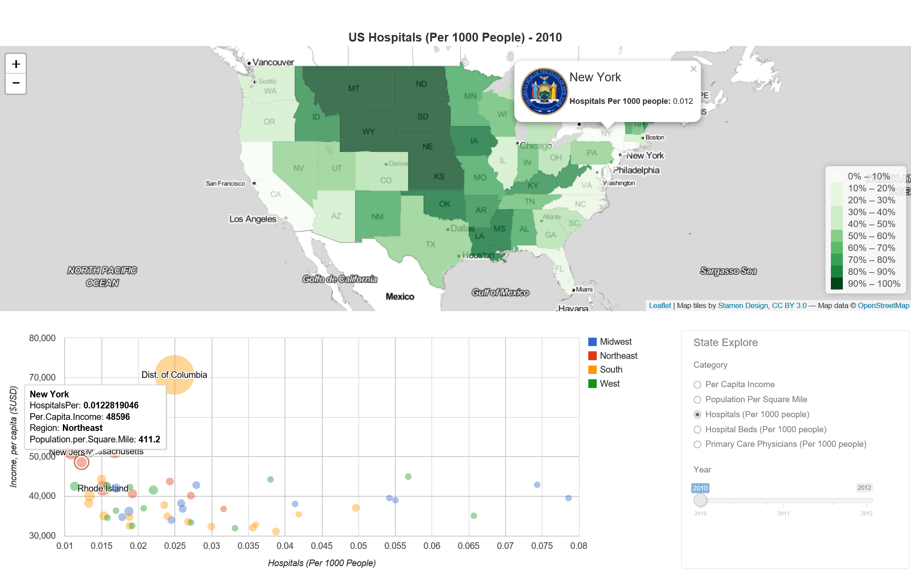
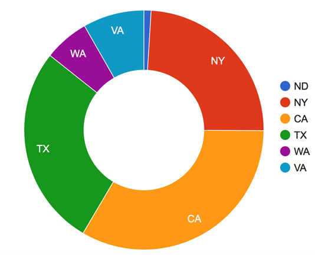
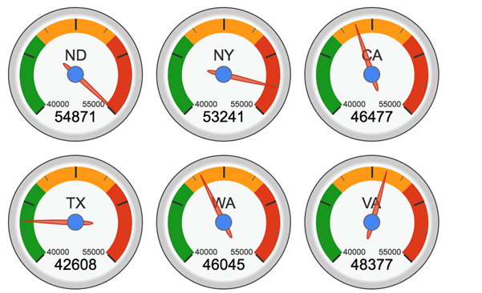
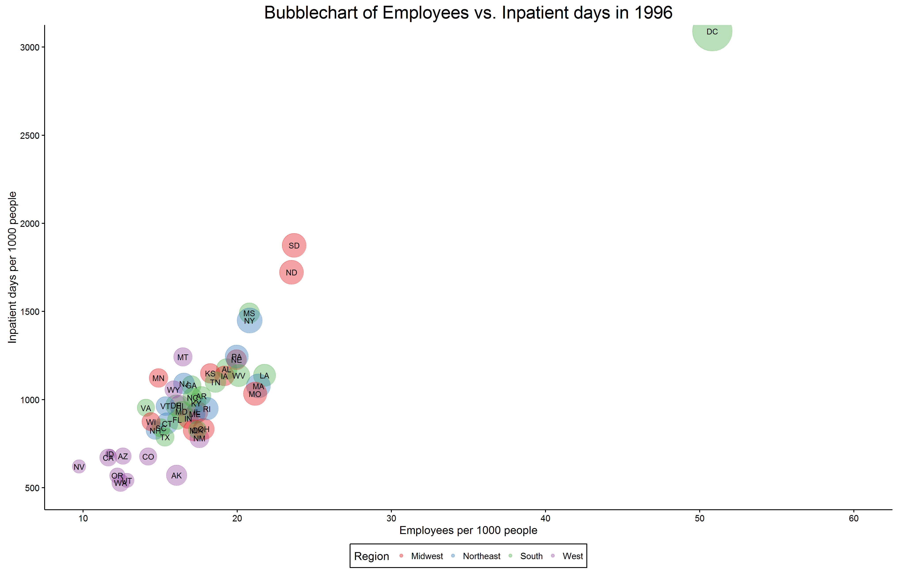

```{r setup, include=FALSE}
knitr::opts_chunk$set(echo = FALSE, out.width="1200")
```

<h2><center><b>EDAV</b></center></h2>
<h3><center><b>PROJECT 3</b></center></h3>
<br/>
<h3><center><b>HEALTHCARE DISTRIBUTION IN USA</b></center></h3>
<br/><br/>
<h4><center>Group 7 Team</center></h4>
<br/<br/>
<h4><b>Introduction:</b></h4>

Health resource distribution in the US is an important issue that concerns most of its citizens. It is strongly related to the wellbeing of the general public.<br/> 

Our team was interested in exploring whether the distribution of various health resources (the number of hospitals, hospital beds, etc.) are correlated with more general factors such as expenditures and income per capita. To find these answers, we used The Health Resources and Services Administration (HRSA) (http://ahrf.hrsa.gov/) downloadable database. The Health Resources and Services Administration (HRSA) is the primary Federal agency for improving access to health care services for people. <br/>


<br/>
<h4><p style="text-decoration: underline">Demographics and Hospitals</p></h4> 

In order to visualize the distribution of health care resources among the 50 states, we used a subset of data containing state level income per capita, population, population density, total hospitals, total hospital beds and number primary physicians. It is important to note that for these visuals, only three years were examined (2010-2012) and that each of the above metrics were normalized to put them on a per capita basis.<br/>

<div style="width: 100%"></div>
<a href="https://ll2948.shinyapps.io/HealthCare/" style="color: blue">click here to run the application.</a>
<br/>
<br/>
The shiny application is composed of 3 panels. The top panel shows a colored US state map showing income per capita, population density, hospitals per capita, hospital bed per capita and primary care physicians per capita based. The bottom left panel displays a bubble chart with income per capita on the vertical axis, and the above listed variables on the horizontal axis. The bubble sizes vary based on population density and the color of bubble is based on the geographical region of each state. The bottom right panel is the control panel, used to choose the category and year to plot.<br/><br/>

The income per capita map shows that states located in the Northeast, as well as a few other states to the west are amongst the wealthiest. <br/><br/>

When we look at population density, we can observe high concentrations along the East and West coasts. The mid-west is particularly high in hospitals per capita as well as hospital bed per capita. Interestingly, New York and California are among lowest 10% in terms of hospitals capita but New York is in the middle in terms of hospital beds per capita, while California is still in the lowest 10%. Perhaps this is because hospitals in New York cater to urban citizens so their medical centers are much larger. While Washington, Oregon and California have fewer hospitals and hospital beds, they don't seem to be lacking in terms of number of primary care physicians. A potential cause for concern is the lack of primary care physicians in places like Idaho, Nevada, Utah and Texas. The map shows the imbalanced distribution of primary care physicians.<br/><br/>

The bubble chart shows little correlation between income per capital and hospitals/hospital beds, but fairly strong correlation between income per capita and primary care physicians.<br/><br/>

<br/>
<h4><p style="text-decoration: underline">Analysis of sample states</p></h4> 
<h5><center><b>Hospital Admissions for Selected States</b></center></h5>
<div style="text-align: center; width: 100%">

</div>
In order to obtain an improved understanding of the relationship between factors affecting the resource distribution, we looked at a few states in greater detail. We chose to analyze the most recent data (from 2012) and six states - North Dakota (ND), New York (NY), California (CA), Texas (TA), Washington (WA) and Virginia (VA), which we believe provide information that can be inferred on the general population. The dataset includes the number of hospital admissions, the population, total medical expenses, income, number of doctors, number of hospitals, number of beds and number of students. <br/>

<h5><center><b>Income per Capital in Each State (unit  $)</b></center></h5>
<div style="text-align: center; width: 100%"></div>
<br/>
The gauge plot shows that the income per capita in NY and ND are apparently higher than the other four states, leading us to believe that perhaps hospital employees and expenditures are correlated.<br/>

<h5><center><b>Correlation of factors in each state</b></center></h5>

```{r, echo=FALSE, message=FALSE, warning=FALSE, out.width='50%', fig.align='center'}
library(corrplot)

HealthData <- read.csv("chydata.csv", header = TRUE)
student <- read.csv("student.csv", head = TRUE)
HealthData$DoctorPer <- HealthData$DoctorNumber * 10000 / HealthData$HospitalAdmission
HealthData$HospitalPer <- HealthData$HospitalNumber * 1000000 / HealthData$HospitalAdmission
HealthData$BedPer <- HealthData$BedNumber * 10000 / HealthData$HospitalAdmission
HealthData$Student <- student$Students
HealthData$StudentPer <- HealthData$Student * 10000 / HealthData$HospitalAdmission

HealthNumeric <- subset(HealthData, select = c(HospitalAdmission, Population, ExpenseonNumber, Income,DoctorPer, HospitalPer,  BedPer, StudentPer ))
colnames(HealthNumeric)[3] <- "Expense"

H <- cor(HealthNumeric)
corrplot(H, method = "circle", title = "", mar=c(0,0,1,0))
```
<br/>
Here we evaluate the correlation between various medical resources and some more general demographic information. The results are quite interesting, we find the number of doctors is positively correlated with the number of hospital admissions, but the number of hospitals and hospital beds are negatively correlated with the number of hospital admissions. This means that in a state with a high number of hospital admissions like CA, NY we might find more doctors but fewer hospitals and hospital beds. This might be because in these states, more doctors work in larger hospitals that serve many people in denser communities. While in other States like WA and VA, the population density is much sparser and there are many small hospitals serving smaller communities.<br/><br/>

Another interesting result is that the number of medical students is strongly correlated to the income of the state. This seems intuitive because many medical schools are also hospitals. Since doctors are in the higher income category, we would expect the respective states to have a higher income as well <br/>
<br/>
<br/>
<h4><p style="text-decoration: underline">Race and Beds Distribution </p></h4>

In this section, we will examine the number of beds per capita in different states more closely. We use the panel data from 2000 to 2012.<br/><br/>

We also decided to explore whether race was an indicator for number of beds per capita by examining the proportion of Caucasians and African-Americans.<br/>

```{r, out.width = '100%', echo=FALSE, message=FALSE, warning=FALSE}
library('ggplot2')
library('plm')
dfph <- read.csv("data_dcf.csv")
fb2010 <- apply(dfph[,86:88], 1, sum)
mb2010 <- apply(dfph[,83:85], 1, sum)
fw2010 <- apply(dfph[,80:82], 1, sum)
mw2010 <- apply(dfph[,77:79], 1, sum)
population <- dfph[,51:63]
population <- as.vector(as.matrix(population))
num_bed <- dfph[,64:76]
num_bed <- as.vector(as.matrix(num_bed))
bed_per_pop <- 1000*num_bed/population
num_fb <- cbind(dfph[39:40], fb2010, dfph[41:50])
prop_fb <- as.vector(as.matrix(num_fb))/population
num_mb <- cbind(dfph[27:28], mb2010, dfph[29:38])
prop_mb <- as.vector(as.matrix(num_mb))/population
num_fw <- cbind(dfph[15:16], fw2010, dfph[17:26])
prop_fw <- as.vector(as.matrix(num_fw))/population
num_mw <- cbind(dfph[3:4], mw2010, dfph[5:14])
prop_mw <- as.vector(as.matrix(num_mw))/population
states <- dfph[,2]
states <- rep(as.vector(states),13)
years <- sort(rep(c(2000:2012),48), decreasing = TRUE)
df <- cbind(years, bed_per_pop, prop_fb, prop_mb, prop_fw, prop_mw)
df <- as.data.frame(df)
df$states <- states
plm <- plm(bed_per_pop ~ prop_fb + prop_mb + prop_fw + prop_mw, data=df,index = c("states","years"), effect="time")
df$fitted <- df$bed_per_pop - plm$residuals
p1 <- ggplot(df, aes(x=log(prop_mb), y=bed_per_pop)) + geom_point(col = "orange")
p1 + facet_wrap(~years, nrow = 3) + stat_smooth(aes(colour="Local Polynomial"), se = FALSE) + stat_smooth(aes(colour="Linear Regression"), method = 'lm', se = TRUE) + scale_colour_discrete("") + xlab("Logarithm Proportion of Blcak Male over 65") + ylab("Beds per 1000 Persons") + labs(title = "Black Man vs Beds per Person") + theme(legend.position = c(0.8, 0.2), legend.text = element_text(colour="black", size=6),
axis.text = element_text(size=6), axis.title = element_text(size=6),
plot.title =element_text(size=8) )

p2 <- ggplot(df, aes(x=log(prop_mw), y=bed_per_pop)) + geom_point(col = "orange")
p2 + facet_wrap(~years, nrow = 3) + stat_smooth(aes(colour="Local Polynomial"), se = FALSE) + stat_smooth(aes(colour="Linear Regression"), method = 'lm', se = TRUE) + scale_colour_discrete("") + xlab("Logarithm Proportion of White Male over 65") + ylab("Beds per 1000 Persons") + labs(title = "White Man vs Beds per Person") + theme(legend.position = c(0.8, 0.2), legend.text = element_text(colour="black", size=6),
axis.text = element_text(size=6), axis.title = element_text(size=6), 
plot.title =element_text(size=8) )

p3 <- ggplot(df, aes(x=fitted, y=bed_per_pop)) + geom_point(aes(colour = " bed_per_pop = \n 660*prop_fb - \n 975*prob_mb + \n 19*prob_fw + \n 33*prob_mw + \n fixed effects\n F = 47.01, p < 0.0001"))
p3 + facet_wrap(~years, nrow = 3) + xlab("Fitted Value of Beds per 1000 Persons ") + ylab("Beds per 1000 Persons") + labs(title = "Panel Linear Regression") +
  theme(legend.position = c(0.82, 0.15), 
        legend.text = element_text(colour="black", size=6,face="bold.italic"),
        axis.text = element_text(size=6), axis.title = element_text(size=6),
        plot.title =element_text(size=8),
        legend.background = element_rect(fill="lightblue",
                         size=0.5, linetype="solid", 
                         colour ="darkblue")) + scale_colour_discrete("") + 
  guides(colour = guide_legend(override.aes = list(shape = NA)))
```
<br/>

The first trellis plot looks at the number of beds per capita versus the logarithm proportion of blank males over 65 years of age while the second looks at the number of beds per capita versus the logarithm proportion of white males over 65. We can see that local polynomial regression shows a negative relationship between the proportion of African-American males and the number of beds per capita in two major intervals. The trend is even more visible if we fit a linear regression to the data. We can observe a positive relationship between the proportion of Caucasian males and the number of beds per capita in the middle interval of local polynomial regression as well as a positive linear trend.<br/><br/>

More formally, we use a fixed effect model for the panel data to train a model in order to fit the data. The F statistic and the p-value along with the actual plots show that the model fits the data well.<br/><br/>

We are not able to definitively say that racial inequality accounts for the discrepancy in the number of beds per capita because we would need much more information to give a concrete explanation. However, these relationships shed some insight as to which areas we could explore further.<br/>
<br/>
<br/>

<h4><p style="text-decoration: underline">Hospitals and Patient admissions</p></h4>

There is high positive correlation between number of hospitals and number of patient admissions at the national level. This is expected, since patients will have more access where there are more hospitals. However, we wanted to check if the number of admissions always increases with number of hospitals in each state.<br/>

```{r, out.width = '100%', echo=FALSE, message=FALSE, warning=FALSE}
library(ggplot2)
library(reshape)

# number of hospitals in 2007 vs 2009 i.e. before and after market crash
f <- read.csv("hospital-bed-population-cleaned.csv")
df1 = melt(data.frame(A=f$Total.Number.Hospitals..2007., B=f$Total.Number.Hospitals..2009., 
                      State=f$State),
           variable_name="Year")

p1 <- ggplot(df1, aes(State, value, fill=Year)) + 
  geom_bar(stat="identity",position="dodge")+
  scale_fill_discrete(name="Year",
                      labels=c("2007", "2009"))+
  xlab("State")+ylab("Number of Hospitals")

p1 <- p1+theme(axis.text.x=element_text(size=6,angle = -60, hjust = -0.5),
               axis.title=element_text(size=6),
               axis.text.y=element_text(size=6),
               legend.text=element_text(size=6),
               legend.title=element_text(size=6))

# compare number of hospital admissions in 2007 vs 2009
df2 = melt(data.frame(A=f$Tot.Hospital.Admissions..2007., B=f$Tot.Hospital.Admissions..2009., 
                      State=f$State),
           variable_name="Year")

p2 <- ggplot(df2, aes(State, value, fill=Year)) + 
  geom_bar(stat="identity",position="dodge")+
  scale_fill_discrete(name="Year",
                      labels=c("2007", "2009"))+
  xlab("State")+ylab("Number of admissions")

p2 <- p2+theme(axis.text.x=element_text(size=6,angle = -60,hjust = -0.5),
               axis.title=element_text(size=6),
               axis.text.y=element_text(size=6),
               legend.text=element_text(size=6),
               legend.title=element_text(size=6))

# plot both plots in one
require(grid)
library(gridExtra)
grid.arrange(p1, p2, ncol=1, top=textGrob("Effect of 2008 market crash on Hospitals and Patient admissions", gp=gpar(fontsize=8, font=3)))

```
<br/>
We generated a distribution of hospitals and patient admissions across states and there is a general trend of more admissions where there are more hospitals. However, there are a few notable exceptions:<br/>
<ul>
<li>TX has the most number of hospitals but CA has the highest number of patient admissions</li>
<li>NY and FL have similar number of hospitals and admissions</li>
<li>Although IL and LA have same number of hospitals, LA has far fewer admissions</li>
</ul>
<br/>
This graph also explores the effect of the 2008 market crash on the number of hospitals and admissions. From the graph, we do not see any discernable change in patient admissions except in CA. We need more details on CA admissions to make any definitive conclusions.<br/>
<br/>
<br/>

<h4><p style="text-decoration: underline">Visual Comparison of States</p></h4>

In order to find additional dependence between Average Hospital Admission, Population by Age, Number of Hospitals and Total population of various states, the following correlation plot and chord diagram was prepared. Strong correlation can be observed between average number of hospital beds and patient admission.<br/>

We wanted to further analyze the correlation of age with number of admissions and number of beds. Correlation plot of average hospital admissions, population by age, number of hospitals and total population of various states was generated. Strong correlation is observed between these factors.<br/>

```{r, echo=FALSE, message=FALSE, warning=FALSE, out.width='50%', fig.align='center'}
library(chron)
library(reshape2)
library(dplyr)
library(corrplot)

# Make the data tidy
makeTidyData <- function(raw_data)
{
  
  tData <- data.frame(
    "StateName" = raw_data[,3], # non-numeric
    
    "TotalPopulation2012" = as.numeric(raw_data[,4]),
    "TotalHospitalAdmission2012" = as.numeric(raw_data[,5]), # numeric, NAs introduced by coercion
    "TotalHospitalAdmission2011" = as.numeric(raw_data[,6]), # numeric, NAs introduced by coercion
    "TotalHospitalAdmission2010" = as.numeric(raw_data[,7]), # numeric, NAs introduced by coercion
    "TotalHospitalAdmission2009" = as.numeric(raw_data[,8]),# numeric, NAs introduced by coercion
    "TotalHospitalAdmission2008" = as.numeric(raw_data[,9]),# numeric, NAs introduced by coercion
    "TotalHospitalAdmission2007" = as.numeric(raw_data[,10]), # numeric, NAs introduced by 
    "TotalHospital2012" = as.numeric(raw_data[,11]), # numeric, NAs introduced by coercion
    "TotalHospital2011" = as.numeric(raw_data[,12]), # numeric, NAs introduced by coercion
    "TotalHospital2010" = as.numeric(raw_data[,13]), # numeric, NAs introduced by coercion
    "TotalHospital2009" = as.numeric(raw_data[,14]), # numeric, NAs introduced by coercion
    "TotalHospital2008" = as.numeric(raw_data[,15]), # numeric, NAs introduced by coercion
    "TotalHospital2007" = as.numeric(raw_data[,16]), # numeric, NAs introduced by coercion
    "TotalBeds2012" = as.numeric(raw_data[,17]), # numeric, NAs introduced by coercion
    "TotalBeds2011" = as.numeric(raw_data[,18]), # numeric, NAs introduced by coercion
    "TotalBeds2010" = as.numeric(raw_data[,19]), # numeric, NAs introduced by coercion
    "TotalBeds2009" = as.numeric(raw_data[,20]), # numeric, NAs introduced by coercion
    "TotalBeds2008" = as.numeric(raw_data[,21]), # numeric, NAs introduced by coercion
    "TotalBeds2007" = as.numeric(raw_data[,22]), # numeric, NAs introduced by coercion
    "TotalPopulation2012" = as.numeric(raw_data[,24]),
    "TotalPopulation2011" = as.numeric(raw_data[,25]),
    "TotalPopulation2010" = as.numeric(raw_data[,26]),
    "TotalPopulation2009" = as.numeric(raw_data[,27]),
    "TotalPopulation2008" = as.numeric(raw_data[,28]),
    "TotalPopulation2007" = as.numeric(raw_data[,29]),
    "TotalMaleLess15" = as.numeric(raw_data[,30]),
    "TotalMale15To19" = as.numeric(raw_data[,31]),
    "TotalMale20To24" = as.numeric(raw_data[,32]),
    "TotalMale25To44" = as.numeric(raw_data[,33]),
    "TotalMale45To64" = as.numeric(raw_data[,34]),
    "TotalMale65Plus" = as.numeric(raw_data[,35]),
    "TotalFeMaleLess15" = as.numeric(raw_data[,36]),
    "TotalFeMale15To19" = as.numeric(raw_data[,37]),
    "TotalFeMale20To24" = as.numeric(raw_data[,38]),
    "TotalFeMale25To44" = as.numeric(raw_data[,39]),
    "TotalFeMale45To64" = as.numeric(raw_data[,40]),
    "TotalFeMale65Plus" = as.numeric(raw_data[,41])
    
  )
  
  return(tData)
}

fname <- "Hospitals-Bed-Population-2007-2012.csv"
raw_data <- read.csv(fname)
tidy_data <- makeTidyData(raw_data)

tidy_data$TotalPopulationLess15 <- tidy_data$TotalMaleLess15 + tidy_data$TotalFeMaleLess15
tidy_data$TotalPopulation15To19 <- tidy_data$TotalMale15To19 + tidy_data$TotalFeMale15To19
tidy_data$TotalPopulation20To24 <- tidy_data$TotalMale20To24 + tidy_data$TotalFeMale20To24
tidy_data$TotalPopulation25To44 <- tidy_data$TotalMale25To44 + tidy_data$TotalFeMale25To44
tidy_data$TotalPopulation45To64 <- tidy_data$TotalMale45To64 + tidy_data$TotalFeMale45To64
tidy_data$TotalPopulation65Plus <- tidy_data$TotalMale65Plus + tidy_data$TotalFeMale65Plus
tidy_data$AvgHostpitalAdmission=rowMeans(tidy_data[,c("TotalHospitalAdmission2012", "TotalHospitalAdmission2011","TotalHospitalAdmission2010","TotalHospitalAdmission2009","TotalHospitalAdmission2008","TotalHospitalAdmission2007")], na.rm=TRUE)
tidy_data$AvgHostpitalBed=rowMeans(tidy_data[,c("TotalBeds2012", "TotalBeds2011","TotalBeds2010","TotalBeds2009","TotalBeds2008","TotalBeds2007")], na.rm=TRUE)
tidy_data$AvgHostpitals =rowMeans(tidy_data[,c("TotalHospital2012", "TotalHospital2011","TotalHospital2010","TotalHospital2009","TotalHospital2008","TotalHospital2007")], na.rm=TRUE)


dataForPCA <- subset(tidy_data, select=c(AvgHostpitalAdmission,TotalPopulationLess15,TotalPopulation15To19,TotalPopulation20To24,TotalPopulation25To44,TotalPopulation45To64,TotalPopulation65Plus,TotalBeds2012,TotalPopulation2012))

corr <- cor(dataForPCA, use="complete.obs")
corrplot(corr, method="pie",type="lower")
```
<br/>
We generated a Circos plot to explore how select states compared in population, number of hospitals, hospital beds and admissions in 2012. The states studied are the top ten by population i.e. CA, TX, NY, FL, IL, PA, OH, GA, MI, NC. Of these states, we find that CA scores more than the other states in all categories - population, beds, admissions and <br/>

```{r, echo=FALSE, message=FALSE, warning=FALSE, out.width='60%', fig.align='center'}
library(chron)
library(reshape2)
library(circlize)
library(dplyr)

# Make the data Tidy
makeTidyData <- function(raw_data)
{
  
  tData <- data.frame(
    "StateName" = raw_data[,3], # non-numeric
    
    "TotalPopulation2012" = as.double(raw_data[,4]),
    "TotalHospitalAdmission2012" = as.double(raw_data[,5]), # numeric, NAs introduced by coercion
    "TotalHospital2012" = as.double(raw_data[,11]), # numeric, NAs introduced by coercion
    "TotalBeds2012" = as.double(raw_data[,17]) # numeric, NAs introduced by coercion
  )
  
  return(tData)
}

fname <- "Hospitals-Bed-Population-2007-2012.csv"
raw_data <- read.csv(fname)
tidy_data <- makeTidyData(raw_data)

# Get the top 10 states by population.
top10Data <- head(tidy_data[order(tidy_data$TotalPopulation2012, decreasing=TRUE), ], 10)

rownames(top10Data) <- top10Data$StateName
top10Data$StateName <- NULL
df = data.frame(from = rep(rownames(top10Data), times = ncol(top10Data)),
                to = rep(colnames(top10Data), each = nrow(top10Data)),
                value = as.vector(top10Data),
                stringsAsFactors = FALSE)
chordDiagram(df)
circos.clear()
```


<h4><p style="text-decoration: underline">Evolution of Health Metrics Over Time</p></h4>
Lastly, we wanted to examine how a few of the important variables changed over time. Specifically, the trends of health expenditures, inpatient days and total number of health personnel (physicians, dentists, RNs, etc.) were visualized. The first plot below is a choropleth map of total health expenditures per capita in each state. Clearly, there is a relation between the geographic location of each state and health expenditures. In general, the western and southern states tend to spend less than the northern (specifically northeastern) states. States like New York, North Dakota and South Dakota are consistently amongst the states with the highest expenditures while Nevada, Idaho, Arizona and Utah are amongst the lowest. Montana is another interesting state to watch: its expenditures increased consistently from 1995-2012. <br/>

<iframe width="1200" height="800" style="text-align:middle"
 src = "https://linglin00.github.io/HealthExpenditure.html" frameborder="0" allowfullscreen>
</iframe>

The last chart is a bubblechart of inpatient days per capita vs. the number of health personnel per capita where the size of the bubble is determined by health expenditures. The one state (or district) that immediately stands out is DC. In every year from 1996-2012, it is the leader in all three of the aforementioned categories by a very large margin. Another interesting observation is the trend of the chart over the years. As time elapses, the number of inpatient days per capita seems to decrease, while the number of employees per capita and health expenditures seem to be increasing. This is a bit odd; we would expect the number of inpatient days to increase as the "baby boomers" age and the healthcare system is forced to take on more elderly patients. It is also important to mention that the western states are always clustered at the bottom left corner of the chart and are the lowest in all three categories.<br/>



<br/>
<br/>
<h4><p style="text-decoration: underline">Conclusion:</p></h4>

To conclude, several different visuals were created to examine the discrepancies in healthcare around the USA. Some interesting conclusions can be drawn from this analysis and in some cases we speculated the causation of certain phenomena. However, one must proceed with caution when making definitive statements about the actual quality of healthcare in each state. For example, the fact that California has fewer hospitals and beds then many other states does not mean that Californians receive inferior medical care. Despite being unable to provide a rigorous analysis of all the variables in the HRSA data warehouse, we were able to discover several significant trends that cannot be overlooked. A more in depth analysis of these trends could potentially yield more concrete results on the discrepancies in healthcare around the country.<br/>
<br/>
<br/>

