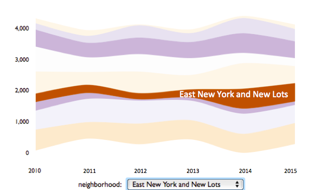
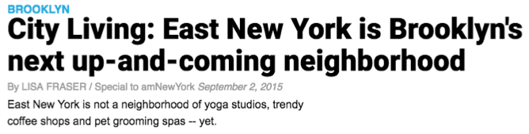
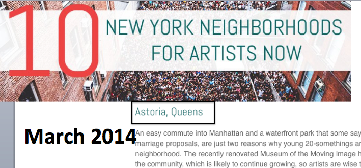
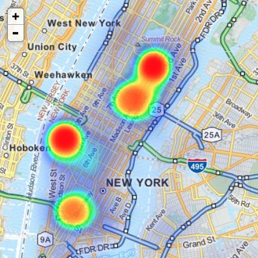

In the previous analysis and correlation matrix, we showed the cluterings of multiple complaints that make intuitive sense. There was, however, one specific complaint that appears decorrelated with every other type of complaint. It was graffiti. To explore why and how graffiti was such an interesting case by itself, we dedicate this section to multiple factors involving graffiti.

##Graffiti, icon for hipster culture
Perhaps graffiti is the most controversial form of complaints in the 311 data. Most people would agree that vehicle noise or broken heating is a pain to the community, but graffiti has been a topic of debate. Certainly many people find the vandalism and nudities carried in the mural paintings disturbing, but plenty others treat them as art that represents hipster culture. In fact, when considering the several neighborhoods that experienced a sharp increase in rental prices in the past decade, one would find that these neighborhoods are more or less associated with a young and hispter dynamic. A causality explanation seems reasonable: young people, together with graffitis, bring dynamics to a neighborhood and makes it trendier. That is usually followed by new restaurants, bars and entertainments, which in turn drive the housing prices higher. 

Hence our first exploration is on the neighborhoods' rental prices and graffiti complaints. Using data from _zillows.com_, we parsed the average rental price in each neighborhood over past 5 years. Then we plot the number of graffiti complaints in the 10 neighborhoods with the biggest housing price surge in a streamgraph.


```{r,eval=TRUE, echo=FALSE,message=FALSE,warning=FALSE}
library(streamgraph)
library(plyr)
library(leaflet)
require(lattice)
library(plotrix)
library(reshape2)
library(reshape)
library(rCharts)
library(ggplot2)
library(rjson)
library('knitr')

graf_geo2=read.csv('graf_geo_nbd1.csv')
graf_closed=read.csv('graf_closed.csv')
kids2015=read.csv('geo_kids_2015.csv')
yr_nbd<- ddply(graf_geo2, .(graf_geo2$year, graf_geo2$nbd), nrow)
names(yr_nbd) <- c("year", "neighborhood", "Freq")
yr_nbd$date=unlist(lapply(yr_nbd$year, function(x){paste(toString(x),'-01-01',sep='')}))
yr_nbd=yr_nbd[!is.na(yr_nbd$neighborhood),]
yrnbd=read.csv('yr_nbd.csv')
yr_nbd_subset=yr_nbd[yr_nbd$neighborhood %in% c('Northwest Brooklyn',
                                                'Bushwick and Williamsburg',
                                                'East Harlem',
                                                'East New York and New Lots',
                                                'Greenpoint',
                                                'Upper West Side',
                                                'Greenwich Village and Soho',
                                                'Central Brooklyn',
                                                'Southwest Brooklyn',
                                                'Northwest Queens'),]
yr_nbd_subset$neighborhood=as.vector(yr_nbd_subset$neighborhood)
```

<center><h4>Graffiti complaints in the 10 neighborhoods with surging housing prices</h4></center>
```{r,eval=TRUE, echo=FALSE,message=FALSE,warning=FALSE}
yr_nbd_subset[yr_nbd_subset$year<2016,] %>%
  streamgraph("neighborhood", "Freq", "year") %>%
  sg_fill_brewer ("PuOr")  %>%
  sg_axis_x(1, "year", "%Y") %>%
  sg_legend(show=TRUE, label="neighborhood: ")
```
As one moves mouse over each stream, it shows the name of the neighborhood and the number of graffiti complaints received each year. We see names we would expect such as Williamsburg. The most interesting insight from this graph is that the only neighborhood that experienced an increase in graffiti is <span style="color:orange">East Newyork & New Lots</span>, a neighborhood that doubled its graffiti density from 2013 to 2014.



More insight can be extracted when we plot the graffiti locations in the neighborhood. In the following graph, the colors represent the days it takes to close the case. That is to say, <span style="color:blue">the darker the color, the longer the graffiti lasts.</span>

##Tough graffitis in New Lots
```{r,eval=TRUE, echo=FALSE,message=FALSE,warning=FALSE}
newlots=(subset(graf_closed[graf_closed$year==2014,]))
newlots=(subset(newlots[newlots$nbd=='East New York and New Lots',]))
qpal1 <- colorQuantile("Blues",newlots$interval, n = 8)
leaflet() %>%
 addTiles() %>% addProviderTiles("OpenStreetMap.BlackAndWhite")%>%
addCircles(data=newlots,lng = ~lon, lat = ~lat, 
                 weight = 1, radius = ~35,color=~qpal1(interval))
```

As one can easily identify on the map, __most of the longer-lasting graffitis are along the subway trail of J and Z line.__ That makes sense as in New Lots, the subway station is above ground, and the graffitis along the trail will have better public exposure which in turn leads to their longer life span. 

We also found an news article identifying New Lots as the next trendy neighborhood. Together with the above-ground graffiti hipster culture, it seems we have a good reason to explain the correlation between the graffiti complaints and housing prices.   __From a Bayesian network perspective, the hipster culture would be the parent of two children: graffiti and housing price.__ 



###Gentrification of the neighborhood drives graffiti out
Unfortunately, sometimes this phenomenon that seems to bring more attention to graffiti can actually turn out to be a bad news for the artists. In early 2014, a similar article identified Astoria as a top neighborhood in NY for artists. In that case, a different story took place: the housing price went up so fast that it soon became no longer affordable for graffiti artists. In the graph below we clearly see how the gentrification forced the artists out. 




</center><h2>Astoria: graffiti and housing price</h2><center>
```{r,eval=TRUE, echo=FALSE,message=FALSE,warning=FALSE}
ap=read.csv('Astoria_50.csv')
names(ap)[2]='complaint'
m2<- melt(subset(ap, select=c(year,complaint, price)), id.var="year")

ggplot(m2, aes(x = year, y = value)) + geom_line(aes(color = variable)) + 
  facet_grid(variable ~ ., scales = "free_y") + theme(legend.text = element_text(size = 17),axis.text.x = element_text(size=14,face='bold'),axis.text.y = element_text(size=12))
```

In the above analysis, we saw how gentrification in areas outside of Manhattan has influenced graffiti's popularity. Will New Lots become the next Astoria where the surging housing prices eventually drive the artists out and force them to find the next yet-to-be trendy block? Maybe. As a side note, in the streamgraph above, SoHo has alread experienced a drop in graffiti complaints in the past 3 years, perhaps mirroring what happened in Astoria.

Now we turn our attention to graffitis within Manhattan, where graffitis don't have the luxury to be exposed in subway trails above ground. In analyzing what affects graffiti in the city, we ask ourselves: who are the people filing complaints on graffitis? After all, graffitis don't give us sleepless nights or freezing apartments that pose harm to our necessities. __Who would bother filing complaints about some perhaps grotesque images or blasphemous phrases on a wall?__ 

##Parents, the concerned audience
Our hypothesis to the above question is that parents with young kids are likely to file complaints on graffitis, so as to prevent their kids' exposure to nudity/vandalis/controversial icons. Because it's hard to access data on distribution of parents in different neighborhoods in Manhattan, we used a proxy by locating the child care centers in the city. Intuitively, __more child care centers in a block suggests a larger density of toddlers and babies.__  The data source is from <span style="color:blue">https://a816-healthpsi.nyc.gov/ChildCare/</span>

###More kids nearby fastens the graffitis to get removed

We did a feature engineering by counting the number of child care centers in 3 blocks of where the graffiti complaint was filed. Then we broke down the data by the number of child centers. For each level of the child care density, we plot the distribution of days graffitis last in the neighborhood (this is calculated as closed date - start date ). 

As we can see from the graph, __the average days it takes to remove graffitis drops from 5 months to 2 months when the number of child cares increase.__  It does seem that parents acts as an extra pressure on the graffiti's survival in Manhattan. 


###Child care and graffiti life span
```{r,eval=TRUE, echo=FALSE,message=FALSE,warning=FALSE}
cbPalette <- c("#999999","#999999", "#E69F00", "#56B4E9", "#009E73", "#F0E442", "#0072B2", "#D55E00", "#CC79A7")

kids2015$count=1
kids2015$Kids=unlist(lapply(kids2015$kids, function(x){(toString(x))}))
kids2015=kids2015[kids2015$kids<9,]
names(kids2015)[37]='Kids'
#names(kids2015)[33]='days it takes to remove graffiti'
ggplot(kids2015, aes(interval, fill = Kids)) + geom_density(alpha = 0.2)+ coord_cartesian(xlim=c(0, 250))+scale_x_continuous(name="days it takes to remove graffiti")+scale_fill_discrete(name="child cares nearby")
```

##Galleries, a refugee for graffiti
So far we saw some bad news for graffiti. Now we want to explore the other side, namely, if any information functions as an indicator that graffiti can be longer lasting. We got our inspiration from the history of graffiti in the city: government declared a war on graffiti in the 80s to eracidate the subculture icon, in support of the _'Fixing Broken Windows'_ philosophy (a statement with a belief in positive correlation between graffiti and crime) Indeed that was an era when graffiti was facing a much tougher situation than today. It was the emerging trend amongst galleries that functioned as a last straw to graffitis. Gallries in New York started to embrace the street art as modern icon for the first time in 90s. This movement greatly helped graffiti's survival.

To validate if the galleries still function as a refugee for graffitis today, we collect data on galleries in the city.<span style="color:blue">(https://data.cityofnewyork.us/Recreation/NYC-Art-Galleries/dqn4-tbkx)</span> We can see an obvious clustering of them from the following heat map. __The three clusterings are Chealsea, Upper East and SoHo__, each indeed known for their various galleries. 


###Gallery heatmap in NYC
```{r,eval=TRUE, echo=FALSE,message=FALSE,warning=FALSE}

gallery=read.csv('gallery.csv')
gallery$count=1
gal=gallery[,c(8,9,10)]
gal_heat=toJSONArray2(na.omit(gal), json = F, names = F) 
```

```{r,eval=FALSE, echo=FALSE,message=FALSE,warning=FALSE}
#show clustering heatmap
L2 <- Leaflet$new()
L2$setView(c(40.7432836,  -73.9032715), 12)
L2$tileLayer(provider = "MapQuestOpen.OSM")
L2$addAssets(jshead = c(
  "http://leaflet.github.io/Leaflet.heat/dist/leaflet-heat.js"
))

L2$setTemplate(afterScript = sprintf("
                                     <script>
                                     var addressPoints = %s
                                     var heat = L.heatLayer(addressPoints).addTo(map)           
                                     </script>
                                     ", rjson::toJSON(gal_heat)
))

L2  
```


This naturally leads us to ask: __in the area with more galleries, do graffitis last longer?__ To validate this hypothesis, we mark zipcodes on a plot, broken down by number of galleries and average days for graffiti cases to be resolved.

Indeed we see a positive trend here: as galleries get more dense in a neighborhood, we see that the graffitis last longer. The three points on the very right of the plot are SoHo, Chelsea and Upper East.

###Positive trend with gallery density and graffiti survival
```{r,eval=TRUE, echo=FALSE,message=FALSE,warning=FALSE}
zipp=as.numeric(names(rev(sort(table(gallery$ZIP)))))
gt=rev(sort(table(gallery$ZIP)))
c=rep(0,dim(gt))
for (x in 1:dim(gt)){c[x]= t(gt)[1,x][1]}
zip_gal=data.frame(zipp,c)
names(zip_gal)=c('zip','galleries')

graf2015=graf_closed[graf_closed$year>=2013,]
graf2015=graf2015[graf2015$interval<=600,]
agg_gal=aggregate(graf2015[,'interval' ], list(graf2015$Incident.Zip), mean)
names(agg_gal)=c('zip','days')

gal_days=merge(agg_gal,zip_gal,by="zip",all=TRUE)
gal_days[is.na(gal_days)] = 0
gal_days=gal_days[gal_days$days>0,]
gal_days=aggregate(gal_days[,'days' ], list(gal_days$galleries), mean)
names(gal_days)=c('gals','days')

ggplot(gal_days, aes(x=gals, y=days)) +geom_point()+geom_smooth(method=lm, se=TRUE)+theme(axis.text.x = element_text(size=14),axis.text.y = element_text(size=14))+xlab("galleries in neighborhood")+scale_y_continuous(name="average days it takes to remove graffiti")+theme(axis.title.x = element_text(size=14),axis.title.y = element_text(size=14))
```


#Conclusion on graffiti complaints
With hypotheses built from history, common sense and daily observations, we explore various aspects of graffiti complaints and some potential causality exploration. What we have here is more of a survival guide for graffiti artists in New York:

__To have your graffiti work last longer and get more public exposure, pick a neighborhood that is just starting to increase its hipster population and housing prices. Make your work in a subway station above ground if possible as more people get to see them and they last longer. Chances are though that the neighborhood will soon get too expensive for you to afford. You have some options, one of which being moving to Manhattan and painting in a block teamed up with galleries. However, be mindful of the concerned parents who would do everything to remove your work, including calling the 311.__